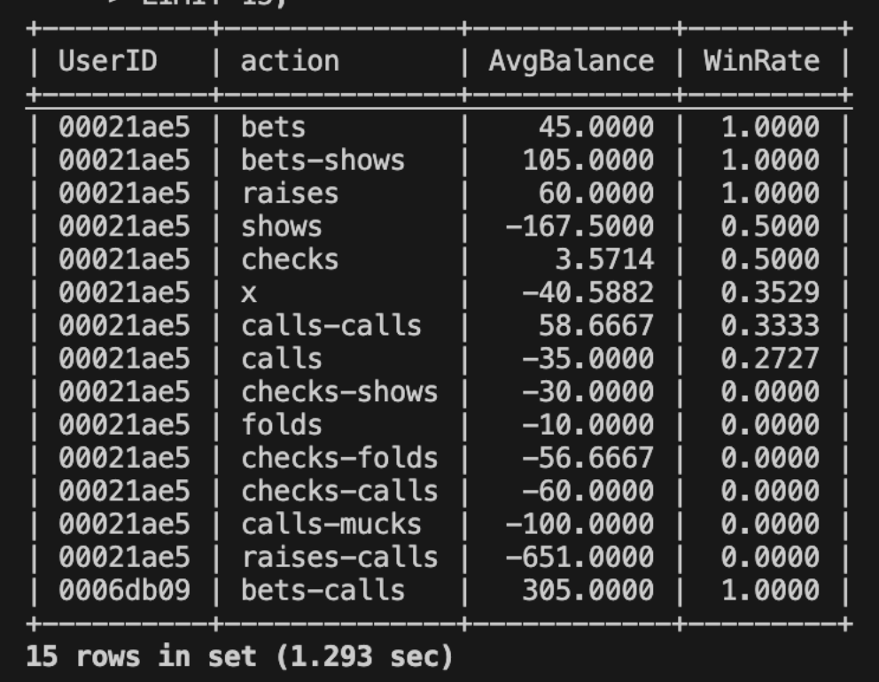
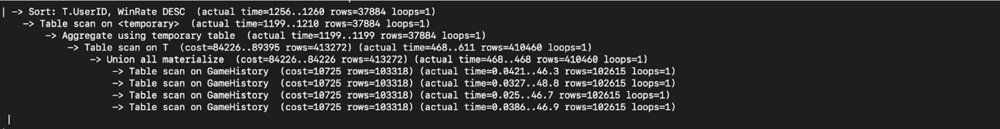
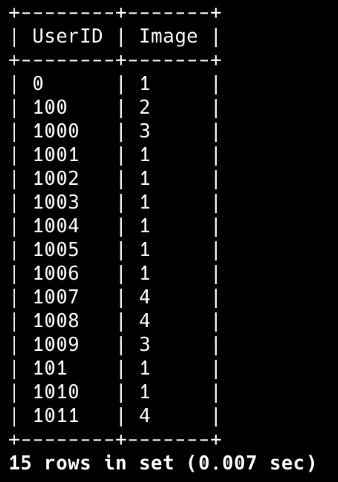

# SQL Tables
## DDL Commands
```sql
CREATE TABLE Skin (
    SkinID VARCHAR(255) PRIMARY KEY,
    Image VARCHAR(255) NOT NULL,
    Description VARCHAR(255) NOT NULL
);

CREATE TABLE Room (
    RoomID VARCHAR(255) PRIMARY KEY,
    Log VARCHAR(255),
    ChatLog VARCHAR(255)
);

CREATE TABLE Account (
    UserID VARCHAR(255) PRIMARY KEY,
    Pass VARCHAR(255) NOT NULL,
    CurrentSkin VARCHAR(255),
    RoomID VARCHAR(255),
    Balance INT,
    FOREIGN KEY (RoomID) REFERENCES Room(RoomID),
    FOREIGN KEY (CurrentSkin) REFERENCES Skin(SkinID)
);

CREATE TABLE Inventory(
    UserID VARCHAR(255),
    SkinID VARCHAR(255),
    FOREIGN KEY (UserID) References Account(UserID) ON DELETE CASCADE,
    FOREIGN KEY (SkinID) References Skin(SkinID),
    PRIMARY KEY (UserID, SkinID)
);


CREATE TABLE Transaction (
    TransactionID VARCHAR(255) PRIMARY KEY,
    SenderID VARCHAR(255), 
    ReceiverID VARCHAR(255), 
    Amount INT NOT NULL,
    DateTime DATETIME NOT NULL,
    Description VARCHAR(255),
    FOREIGN KEY (SenderID) REFERENCES Account(UserID) ON DELETE SET NULL,
    FOREIGN KEY (ReceiverID) REFERENCES Account(UserID) ON DELETE SET NULL
);


CREATE TABLE GameHistory(
    HandID VARCHAR(255),
    UserID VARCHAR(255),
    DateTime DATETIME NOT NULL,
    buyin VARCHAR(255),
    blinds_level INT,
    init_stack INT,
    position VARCHAR(3),
    action_pre VARCHAR(255),
    action_flop VARCHAR(255),
    action_turn VARCHAR(255),
    action_river VARCHAR(255),
    all_in BOOLEAN,
    cards VARCHAR(255),
    board_flop VARCHAR(255),
    board_turn VARCHAR(255),
    board_river VARCHAR(255),
    pot_pre INT,
    pot_flop INT,
    pot_turn INT,
    pot_river INT,
    ante INT,
    bet_pre INT,
    bet_flop INT,
    bet_turn INT,
    bet_river INT,
    result VARCHAR(255),
    balance INT,
    PRIMARY KEY (HandID, UserID),
    FOREIGN KEY (UserID) REFERENCES Account(UserID)
);
```

Test Tables
```sql

CREATE TABLE Account (
    UserID VARCHAR(255) PRIMARY KEY,
    Balance INT
);

CREATE TABLE Transaction (
    TransactionID VARCHAR(255) PRIMARY KEY,
    SenderID VARCHAR(255), 
    ReceiverID VARCHAR(255), 
    Amount INT NOT NULL,
    FOREIGN KEY (SenderID) REFERENCES Account(UserID) ON DELETE SET NULL,
    FOREIGN KEY (ReceiverID) REFERENCES Account(UserID) ON DELETE SET NULL
);
```

0. Trigger: Update on Account Balance on change in Transaction
```sql
delimiter //
CREATE TRIGGER update_balance AFTER INSERT ON Transaction
FOR EACH ROW BEGIN
    UPDATE Account SET balance = balance - NEW.Amount WHERE UserID = NEW.SenderID;
    UPDATE Account SET balance = balance + NEW.Amount WHERE UserID = NEW.ReceiverID;
END;
//
```


## MySQL CLI Table Screenshots
### Tables

### Total Row Counts


# Advanced SQL Queries


## 1. User Performance Query
The query retrieves the user performance for different moves in gameplay, showing the average balance and win rate for each type of game action that they do.

### SQL Code
```sql
SELECT UserID, action, AVG(balance) AS AvgBalance, SUM(CASE WHEN balance > 0 THEN 1 ELSE 0 END) / COUNT(balance) AS WinRate
FROM 
    (SELECT UserID, balance, action_pre AS action
        FROM GameHistory
        UNION ALL
        SELECT UserID, balance, action_flop AS action
        FROM GameHistory
        UNION ALL
        SELECT UserID, balance, action_turn AS action
        FROM GameHistory
        UNION ALL
        SELECT UserID,  balance, action_river AS action
        FROM GameHistory) AS T
GROUP BY action, UserID
ORDER BY UserID, WinRate DESC
LIMIT 15;
```

#### As Stored Procedure
```sql
DELIMITER //

CREATE PROCEDURE getUserPerformance(userid VARCHAR(255)) BEGIN
    SELECT UserID, action, AVG(balance) AS AvgBalance, SUM(CASE WHEN balance > 0 THEN 1 ELSE 0 END) / COUNT(balance) AS WinRate
    FROM 
        (SELECT UserID, balance, action_pre AS action
            FROM GameHistory
            UNION ALL
            SELECT UserID, balance, action_flop AS action
            FROM GameHistory
            UNION ALL
            SELECT UserID, balance, action_turn AS action
            FROM GameHistory
            UNION ALL
            SELECT UserID,  balance, action_river AS action
            FROM GameHistory) AS T
    WHERE UserID = @userid
    GROUP BY action
    ORDER BY WinRate DESC;
END//
```

### Example Execution on MySQL DB


### Query Analysis
**Attributes of GameHistory Table Used in Query \#1 JOIN/GROUP BY/HAVING/WHERE and NOT PRIMARY KEY:**

UserID, balance action\_pre, action\_flop, action\_turn, action\_river

**Index Groupings:**

1. UserID  
2. balance  
3. (UserID, balance)  
4. (UserID, action\_pre) \+ (UserID, action\_flop) \+ (UserID, action\_turn) \+ (UserID, action\_river)  
5. (UserID, balance, action\_pre) \+ (UserID, balance, action\_flop) \+ (UserID, balance, action\_turn) \+ (UserID, balance, action\_river)

Cost Analysis (Before Using Indexes): 


**Cost: 84226**

Cost Analysis (Index Grouping 1):


**Cost: 84226**

Cost Analysis (Index Grouping 2):


**Cost: 84226**

Cost Analysis (Index Grouping 3):



**Cost: 84226**

Cost Analysis (Index Grouping 4):


**Cost: 84226**

Cost Analysis (Index Grouping 5):


**Cost: 84226**

#### Analysis
For this query, we notice that all the indexes we explored had no net change on the cost. We notice that running this query without the use of indexes results in a cost of 84226 and this number did not improve throughout testing 5 different index groupings. A reason for this could be due to the fact that our query is structured such that all rows in the GameHistory table have to be processed given that our query does not have a WHERE clause. The need to process all rows in our table can also be due to the fact that we are employing multiple aggregate functions in the query as well.  
   
In this case, there is no need to index.


## 2. Currently Playing With
This query returns the skins of all the players in a specific room. 

### SQL Code
```sql
SELECT UserID, Image
FROM (SELECT * FROM Account WHERE RoomID = 0) AS UserInRooms
JOIN Skin ON SkinID = CurrentSkin
LIMIT 15;
```
### Example Execution on MySQL DB


### Query Analysis
**Attributes of Account table Used in Query \#2 JOIN/GROUP BY/HAVING/WHERE and NOT PRIMARY KEY:**

RoomID (Account), CurrentSkin (Account)

**Index Groupings:**

1. RoomID (single attribute index)  
2. CurrentSkin (Account)  
3. (RoomID,CurrentSkin)

Cost Analysis (Before Adding Indexes): 


**Cost: 464**

Cost Analysis (Index Grouping 1):


**Cost: 464**

Cost Analysis (Index Grouping 2):


**Cost: 391**

Cost Analysis (Index Grouping 3):


**Cost: 464**

#### Analysis

We notice that starting from an initial cost of 464 where the query was run with no indexes and having tested out three indexes, the second one (having an index on the CurrentSkin attribute) reduces the cost while the other two indexes had no effect on cost. Therefore, for our final design, we will choose to add an index on CurrentSkin in the Account table.


## 3. Activity Tracker
This query retrieves the daily activity of a user over multiple days, specifically counting the total amount of transactions that occur in game and outside of the games every day. 

### SQL Code
```sql
SELECT g.UserID, g.Date, g.GameCount, t.NonGameCount, g.GameCount + t.NonGameCount AS TotalActivity
FROM 
    (SELECT UserID, DATE(DateTime) AS Date, COUNT(*) AS GameCount
     FROM GameHistory
     GROUP BY UserID, DATE(DateTime)) AS g
JOIN 
    (SELECT DISTINCT UserID, Date, COUNT(*) AS NonGameCount
     FROM 
((SELECT SenderID AS UserID,  DATE(DateTime) AS Date 
FROM Transaction 
WHERE SenderID <> 'TEXAS_HOLDEM')
 UNION ALL 
(SELECT ReceiverID AS UserID,  DATE(DateTime) AS Date 
FROM Transaction 
WHERE ReceiverID <> 'TEXAS_HOLDEM' )) AS CombinedTransactions
    GROUP BY UserId, Date) AS t
ON g.UserID = t.UserID AND g.Date = t.Date
ORDER BY g.Date
LIMIT 15;
```

### Query Analysis
**Attributes of GameHistory/Transactions Used in Query \#3 JOIN/GROUP BY/HAVING/WHERE and NOT PRIMARY KEY:**

UserID (GameHistory), DateTime (GameHistory), DateTime (Transaction), SenderID (Transaction), ReceiverID (Transaction)

**Index Groupings:**

1. UserID (GameHistory), DateTime (GameHistory)  
2. SenderID (Transaction), DateTime (Transaction)   
3. ReceiverID (Transaction), DateTime (Transaction)   
4. SenderID (Transaction), ReceiverID (Transaction), DateTime (Transaction) \=\> grouped on UIDs in transaction  
5. (UserID (GameHistory), DateTime (GameHistory)) \+ (SenderID (Transaction),DateTime (Transaction))  
6. (UserID (GameHistory), DateTime (GameHistory)) \+ (ReceiverID (Transaction),DateTime (Transaction))  
7. (UserID (GameHistory), DateTime (GameHistory)) \+ (SenderID(Transaction),ReceiverID (Transaction),DateTime (Transaction))

Cost Analysis (Before Using Indexes):


**Cost: 792433**


Cost Analysis (Index Grouping 1):


**Cost: 440757**

Cost Analysis (Index Grouping 2):


**Cost: 221027**

Cost Analysis (Index Grouping 3): 


**Cost: 221027**

Cost Analysis (Index Grouping 4):


**Cost: 396733**

Cost Analysis (Index Grouping 5):


**Cost: 221027**

Cost Analysis (Index Grouping 6):


**Cost: 396797**

Cost Analysis (Index Grouping 7):


**Cost: 221027**

#### Analysis

Our query starts with a significant initial cost of 792433 when run with no selected indices. From this, we test out 7 different index groupings from the following attributes which we narrowed down to have potentially the most significant impact on **reducing cost: UserID (GameHistory), DateTime **(GameHistory), DateTime (Transaction), SenderID (Transaction), and ReceiverID (Transaction). 

We notice that index 2, 3, 5, and 7 all shared the lowest total cost at 221027. An index on the GameHistory table is not required, while it absolutely is required in the Transaction table on attributes DateTime and either SenderID or ReceiverID. In the case that we do add an attribute on UserID and DateTime in the GameHistory table, then we have to also add an attribute on both SenderID and ReceiverID, in addition to DateTime, in the Transaction table.

Therefore, for simplicity sake, we decided to add an index on just the SenderID and DateTime attributes in the Transaction table.


### Example Execution on MySQL DB


## 4. Game Cash Flow
This query retrieves all the transactions for a specific game, in this case being the Texas Hold’Em game.

### SQL Code
```sql
SELECT TransactionID, SenderID, ReceiverID, Amount, CONVERT(DateTime, DATE) AS TransactionDate
FROM Transaction
WHERE SenderID = 'TEXAS_HOLDEM' OR ReceiverID = 'TEXAS_HOLDEM'
GROUP BY TransactionDate, TransactionID, SenderID, ReceiverID, Amount
LIMIT 15; 
```

### Example Execution on MySQL DB


### Query Analysis
**Attributes of Transaction Used in Query \#4 JOIN/GROUP BY/HAVING/WHERE and NOT PRIMARY KEY:**

DateTime, SenderUID, ReceiverUID, Amount

**Index Groupings:**

1. DateTime (Transaction)  
2. SenderID  
3. ReceiverID  
4. SenderID,ReceiverID \=\> groped on IDs in transaction  
5. Amount (Transaction) \=\> grouped on amount  
6. DateTime, SenderUID, ReceiverUID, Amount \=\> grouped by all attributes

Cost Analysis (Before Using Indexes): 


**Cost: 8794**

Cost Analysis (Index Grouping 1):


**Cost: 8794**

Cost Analysis (Index Grouping 2):


**Cost: 8794**

Cost Analysis (Index Grouping 3): 


**Cost: 8794**

Cost Analysis (Index Grouping 4): 


**Cost: 8794**

Cost Analysis (Index Grouping 5): 


**Cost: 8794**

Cost Analysis (Index Grouping 6):


**Cost: 8794**

#### Analysis

For this query, we notice that all the indexes we explored had no net change on the cost. We notice that running this query without the use of indexes results in a cost of 8794 and this number did not improve throughout testing 6 different index groupings. 

A potential reason for this could be due to the OR condition in our WHERE clause. While we are filtering rows in the Transaction table, the use of the OR operator ensures that there are still a lot of rows that can be considered, which can lead to a decreased search optimization. 

In this case, there is no need to index.


## 5. Round statistics
This query retrieves the game histories of all players involved in the game that a specific player was in. The results will be grouped by players to show the individual stats of the players involved in the game. 
### SQL Code
```sql
SELECT 
    UserID,
    SUM(CASE WHEN balance > 0 THEN 1 ELSE 0 END) AS Positive,
    SUM(CASE WHEN balance < 0 THEN 1 ELSE 0 END) AS Negative,
    SUM(CASE WHEN balance = 0 THEN 1 ELSE 0 END) AS Zero
FROM GameHistory
WHERE  handID IN ( SELECT handID 
FROM GameHistory g 
WHERE g.UserID LIKE "00021ae5")
GROUP BY UserID
LIMIT 15;
```
### Example Execution on MySQL DB


*Note: the output is less than 15 rows. We will be using this query to get stats on every person the arbitrarily selected user* `00021ae5` *played against. When the user* `00021ae5` *plays against more distinct people, this set will increase. We will call this query when we have a specific UserID we want to look at.*

### Query Analysis
**Attributes of GameHistory Used in Query \#5 JOIN/GROUP BY/HAVING/WHERE and NOT PRIMARY KEY:**

UserID, HandID

**Index Groupings:**

1. UserID  
2. HandID  
3. (UserID,HandID)

Cost Analysis (Before Using Indexes): 


**Cost: 1.07e9**

Cost Analysis (Index Grouping 1): 


**Cost: 55103**

Cost Analysis (Index Grouping 2):


**Cost: 81060**

Cost Analysis (Index Grouping 3):


**Cost: 46886**

#### Analysis

Our query starts with a significant initial cost of 1.07e9 when run with no selected indices. From this, we test out 3 different index groupings from the following attributes which we narrowed down to have potentially the most significant impact on reducing cost: UserID (GameHistory), HandID (GameHistory) 


We notice that of the three indices, adding an index on HandID resulted in the lowest cost decrease from our original starting point (although it improved total cost by a significant margin), followed by indexing UserID, and finally ending with the greatest cost decrease when indexing both HandID and UserID together. 

Due to this, our final index design will be to add an index to both the HandID and UserID attributes in the GameHistory table.
