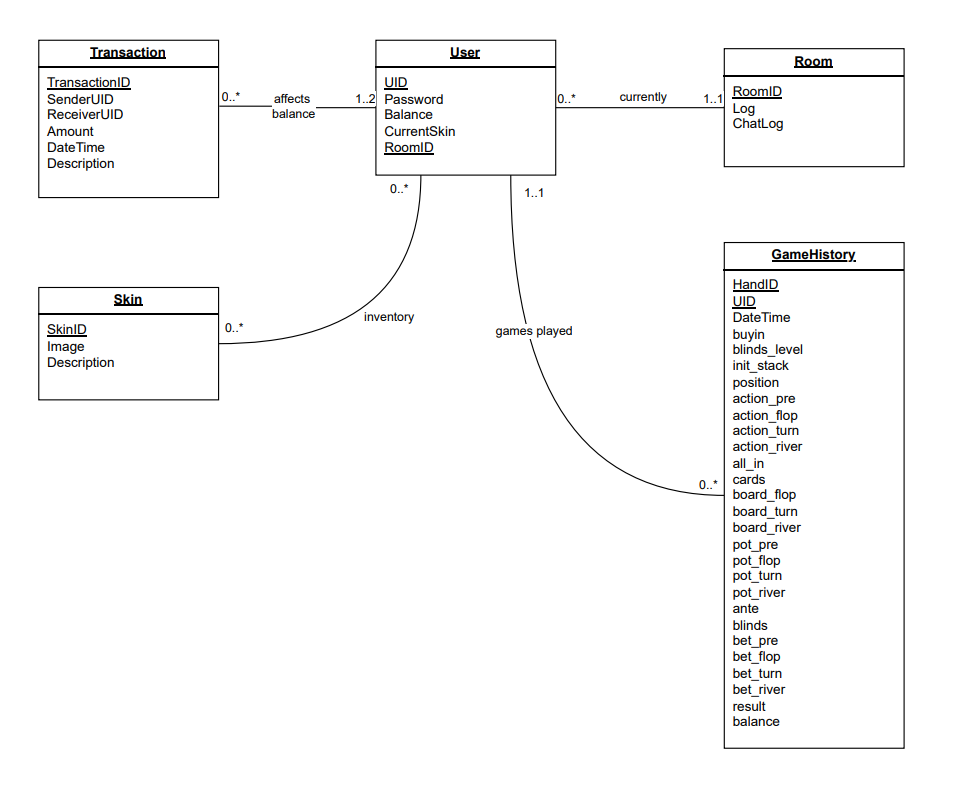

# UML Diagram

## Rationale
For our database design, we have the entities `User`, `Room`, `GameHistory`, `Transaction`, and Skin.

The `User` entity keeps track of all general user information, including attributes such as userid(UID), password, and balance. This is kept as a separate entity because general user information needs to be grouped together into one entity and cannot be divided into individual attributes for other entities because those entities contain a lot more specific information, such as information relating to a specific Room. The `User` entity is connected to all other entities, and their individual relationships will be discussed later. 

The `Skin` entity will store all skins for sale in our shop. Each user will be able to buy the same skin for the same price. Because many users can own the same skin and one user can own many skins, this will be a many-to-many relationship. The Inventory will be the relationship between the `User` and `Skin` entities, keeping track of what skins each user owns.

The `GameHistory` entity will store the history of all moves made by each user in every hand they play. There will be a unique ID for each hand, but if there are n users playing in the hand, there will be n tuples with the same HandID, but different UserIDs. Similarly if a user plays n hands,  there will be n tuples with the same UserID but different HandIDs. Because of this, we use both HandID and UserID as the primary key. Additionally, because every game history belongs to a specific user and since a user can have multiple gamehistories (if they play multiple hands) users have a many-to-one relationship. The games played will be the relationship between the `User` and `GameHistory` entities, keeping track of what histories belong to each user. 

The `Room` entity will keep track of all current rooms and their logs and chat logs. We want to keep track of open rooms, but we also don’t want to store closed rooms. The Log and ChatLog attributes are strings of the file path to the file that needs to be read/updated. For `User` and Room, since each room can have multiple users at once, but each individual user can only be in one room at a time, they have a one-to-many relationship. The current will be the relationship between the `User` and `Room` entities, keeping track of what room each user is currently in. 

`Transaction`  will store all currency changes made. This includes betting in a hand, winning pots, sending people money, and buying skins from the shop. When betting in a hand or winning a pot, the sender or receiver will respectively have UID as HandID. Since each transaction either involves a sender and a receiver (two parties), or a HandID and a user (one party), each transaction references one to two Users. Additionally, each user can have many different transactions so we are defining this as a many-one/two relationship. The affects balance will be the relationship between the `User` and `Transaction`  entities, keeping track of what transactions affect each user.