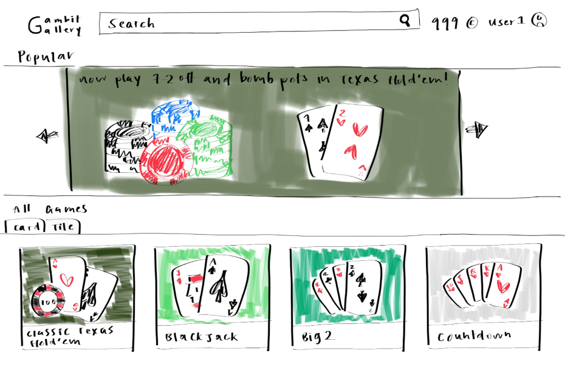

# Gambit Gallery

# Project Summary: 

Gambit Gallery is a centralized online platform where users can play their favorite strategy-based card games with their friends, with games available for multiplayer play such as Mahjong, Poker, and other classic titles. Each game  is its own entity, and players can play unlimited rounds for each game so long as every other player is also willing to continue and each has the currency to join. 

On this platform, users can login and access a shared in-game currency that is used across all games. While each game will be its own separate entity with its own animations and designs, all games will use this same central currency. This currency can be earned primarily through winning a game where currency is bet, or passively through daily quests given by our platform so all players can play. Of course, the currency can also be deducted through actions such as placing bets, or paying entry fees for limited time event games. This fosters a simple ecosystem where players can use one currency to play whatever game that they want, rather than having to play on different platforms or the pressure of using real money. There is also a gifting system, where players can gift currency to other players to promote collaboration and goodwill.

# Description of an Application

Many people don’t want to buy a deck of cards, poker chips, and mahjong tiles. As a result, if a group of friends want to play a card or mahjong game, they have to find an online version and create accounts to play. Additionally, if friends want to track their overall wins and losses across the different card and mahjong games, they would have to calculate values from each website. Gambit Gallery aims to be a one stop shop for all card and tile games where friends only need one account and can easily change the gamemode with the click of a button. The currency is centralized so friends can see their net gains from all games.

# Creative Component

We are going to have a robust Graphical User Interface for both our platform and our games, with a sleek and intuitive platform interface, while our games will have a homey table-top feel with smooth animations. Every user will also have a unique account associated with them, so they can keep their winnings from each game.

With these types of games, we’re implementing real time multiplayer support for the most fun\! We also plan on having a game log for our games, including match data for the user to review, like "most frequent hands won," "betting patterns," or "win percentage", for users to reflect on their performance.

# Usefulness

We are creating an entertainment platform where users can play multiple games online. They can easily play multiple games with their friends without the need to own the deck or cards themselves. Users can do basic actions such as play the games, create and join rooms, review their past games, transfer currency, and make friends. It’s useful because it gives users a centralized hub for games, while giving people the opportunity to try out games with a pre-established community without having to foster a new one.

There are many websites and apps for online multiplayer card games; however, they are usually for only one game. Examples include MahjongSoul and PokerNow. Our app aims to combine multiple games for a streamline process to switch between different games.

# Realness

The nature of an online strategy based card game is such that we can keep note of several key metrics. For example, metrics relevant to user behavior for a game such as Poker can be in the form of frequency/size of bets placed, win/loss ratio, type of win/loss, sequence of actions, and so forth. 

At a high level, we use the above dataset to demonstrate our product’s ability to comprehensively simulate a gamesuite environment. Through populating tables with both auto-generated and dataset derived data, we show that our product’s capable of supporting both in-game operations as well as other functionalities in our gamesuite environment. Populating our tables with pre-selected data essentially serves as a proof of concept to show that our product can track user relevant, game relevant, and other attribute relevant information (such as transactions).

# Dataset application

We use our first dataset ([https://www.kaggle.com/datasets/murilogmamaral/online-poker-games](https://www.kaggle.com/datasets/murilogmamaral/online-poker-games)) in the following manner:

- This dataset represents simulated Poker games in which 35 columns of in-game relevant data are stored (such as buy-in, blinds, balance, result, etc.)   
- We use the information stored in this dataset to populate our GameHistory table, which essentially represents the game history from start to finish by tracking various in-game metrics  
- By doing this, we are essentially “simulating” end-to end Poker games and verifying that when users are running games in real time, the relevant in-game data will be collected and stored properly

Our second dataset will be auto-generated but follows a similar pattern:

- Our auto-generated data can represent out-of-game functionality such as transaction history, user management, room management, and more.  
- For example, we can auto generate relevant entries that we insert into our Skins, Users, Room, and/or Transaction table. By auto-generating the data that we add into our tables, we now not only simulate and test in-game operations, but additionally out-of-game functionalities such as transactions and user profile updates. Populating data into our tables not only validates via simulation that our in/out of game functionality works, but allows us to generate more data (i.e., simulating transactions from existing user data adds entries to the transactions table), contributing to expanding our current dataset(s).

# Functionality

## UI mockup:

## CRUD Operations

When users access our platform, they will be able to create their own account, create a new room to play with their friends, and create new transactions through actions such as playing games or making new transfers of currency to other users. Users can also delete their account and delete their rooms automatically when every user in that room leaves. Users can update their password and then update their balance through actions such as playing games, buying items, and sending/receiving currency. Finally, users can search for a new room to join, search through their past transactions, and the history of the games they played as well as the stats on those games. 

# Project work distribution 

Each team member will do one of the following tasks for the Main Platform. Each member of the team will then work together on all tasks for the first game, Blackjack, to gain familiarity with the systems. We will assign leaders to each task. They will be responsible for managing the task and planning out how teammates could work together on it.

Afterwards, each team member will work on their own game and incorporate it into the main application.

## Tasks for Main Platform

1) FrontEnd of MainPlatform(designing frontend of website once user has logged in, with appropriate pictures, and buttons) \-Kaushal Amancherla  
2) Connecting FrontEnd to BackEnd of Main Platform(setting up API/server-side of backend, designing db schema, which is communicated to other backend person) \-Daniel Cao  
3) Backend of Main Platform(how db works, managing db, sets up physical implementation of DB including server config, db connections, etc) \- Ethan Chang  
4) Dealing With Login and Profile page and Storing that Data (both backend and frontend) \- Julia Shen

## Black Jack Tasks:

5) Connecting FrontEnd to Backend of Black Jack(setting up API/server-side of backend, designing db schema, which is communicated to other backend person)  
6) Backend of Main Platform(how db works, managing db, sets up physical implementation of DB including server config, db connections, etc)  
7) Frontend of BlackJack (designing frontend of game)  
8) Designing and Implementing Animations of UI, etc
